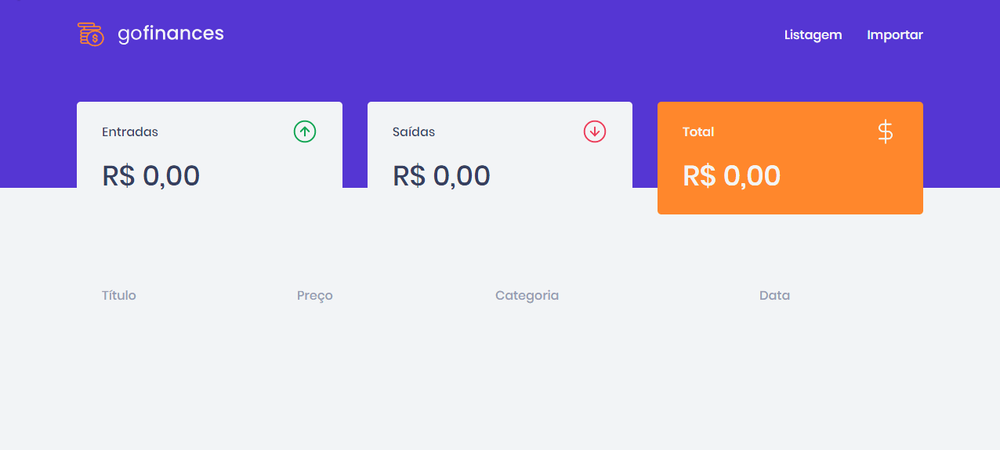

<h2 align="center">
    
</h2>
  
<p align="center">
  

  

  	
  <a href="https://www.linkedin.com/in/gabriel-pereira-oliveira-78b1801ab/">
    
  </a>
	
  
  <a href="https://github.com/Gabrielpdev/Ecoleta/commits/master">
    
  </a>

  
   <a href="https://github.com/Gabrielpdev/GoFinaces/stargazers">
    
  </a>
</p>

<h2 align="center">
    
</h2>

### 📜 Sobre
Projeto desenvolvido durante o **GoStack** oferecido pela [Rocketseat] :rocket:.

O GoFinaces é um gerenciamento de transações, nele você visualiza todas suas transações e ainda adiciona novas atravez de envio ded arquivo.

A aplicação em **Node.js** (backend) é uma **API REST** escrita em **Node.JS** que serve dados ao frontend.

A aplicação em **ReactJS** (frontend) é para visualizar suas transações e adicionar outras enviando um arquivo csv.

### :rocket: Começando
```bash
$ git clone https://github.com/Gabrielpdev/GoFinaces.git
$ cd GoFinaces
```
### :rocket: Iniciando com o backend
```bash
$cd Backend

# Cofigurar ormconfig.json de acordo com o seu banco de dados
$ yarn
$ yarn typeorm migration:run
$ yarn dev:server
```
### 💻 Iniciando com o Front-end 
```bash
$ cd Frontend
$ yarn
$ yarn start
```
### 🧰  Ferramentas utilizadas

As seguintes ferramentas foram usadas na construção do projeto:
- 🔵 [TypeScript][typescript]
- 🟢 [Node.js][nodejs]
- ⚛️ [React][reactjs]
- 💅 [Styled-components]

## 📝 Licença

Feito com ❤️ por Gabriel Pereira 👋🏽 [Entre em contato!](https://www.linkedin.com/in/gabriel-pereira-oliveira-78b1801ab/)

[nodejs]: https://nodejs.org/
[typescript]: https://www.typescriptlang.org/
[reactjs]: https://reactjs.org
[yarn]: https://yarnpkg.com/
[vscode]: https://code.visualstudio.com/
[license]: https://opensource.org/licenses/MIT
[rs]: https://rocketseat.com.br
[Rocketseat]:https://github.com/Rocketseat
[styled-components]:https://styled-components.com/
